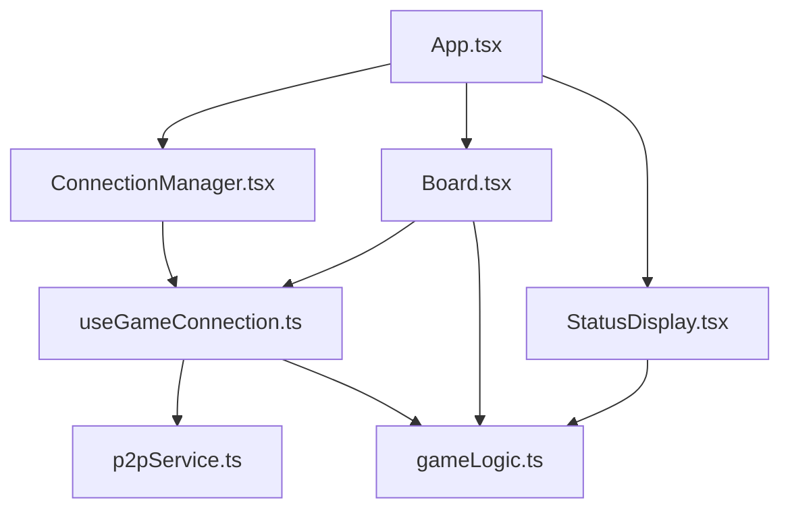

# System Patterns: ChessOnGithub

## 1. System Architecture

The application follows a component-based architecture, primarily on the frontend, using React.

- **Frontend:** Built with React and TypeScript.
    - **UI Components:** Responsible for rendering the game interface (e.g., `Board.tsx`, `StatusDisplay.tsx`, `ConnectionManager.tsx`).
    - **State Management:** Initially, component state and prop drilling will be used. If complexity increases, a React Context or a more robust state management library (like Zustand or Redux Toolkit) might be considered.
    - **Hooks:** Custom hooks (e.g., `useGameConnection.ts`) encapsulate specific logic, like P2P communication.
- **Game Logic:** Managed by a dedicated module (`gameLogic.ts`) using the `chess.js` library. This module is responsible for move validation, game state updates (FEN strings), and checking game end conditions.
- **P2P Communication:** Handled by `p2pService.ts` and utilized through the `useGameConnection.ts` hook. This service manages the underlying WebRTC or similar P2P connection, sending and receiving game-related messages.

## 2. Key Technical Decisions

- **`chess.js` for Core Logic:** Chosen for its comprehensive chess rule implementation, FEN string manipulation, and move validation capabilities.
- **`react-chessboard` for UI:** Selected for its ease of integration with React and for providing a ready-to-use chessboard component.
- **TypeScript for Type Safety:** Enhances code quality and maintainability.
- **P2P for Direct Connection:** Avoids the need for a central server for gameplay, simplifying deployment and reducing infrastructure costs for basic gameplay.

## 3. Design Patterns in Use

- **Component-Based Architecture:** Standard in React applications.
- **Custom Hooks:** For encapsulating reusable stateful logic.
- **Event Bus (Potential):** `src/utils/eventBus.ts` exists, suggesting its potential use for decoupled communication between components, although its current usage needs verification.
- **Service Layer:** `p2pService.ts` acts as a service for handling P2P communication.
- **Module for Game Logic:** `gameLogic.ts` centralizes chess-specific rules and state management.

## 4. Component Relationships (High-Level)

## 5. Critical Implementation Paths

- **P2P Connection Establishment:** Ensuring reliable connection setup between two players.
- **Game State Synchronization:** Accurately transmitting and applying moves between players to maintain a consistent game state.
- **Move Validation and Execution:** Correctly integrating `chess.js` to validate player moves and update the board.
- **Turn Management:** Clearly indicating and enforcing whose turn it is.